# Data Dictionary and Entity-Relationship Diagram (ERD)

Este documento especifica a tipagem física em PostgreSQL, chaves primárias (PK), chaves estrangeiras (FK), nulabilidade (`NOT NULL`) e valores padrão de todas as entidades do sistema **SiteGaragem**, alinhado com [Docs/docs.md](file:///c:/Users/rauld/OneDrive/Área de Trabalho/Projetos/SiteGaragem/back-end-garagem/Docs/docs.md).

---

## 1. Diagrama ERD em Formato Mermaid

```mermaid
erDiagram
    STORES ||--o{ VEHICLES : "belongs_to"
    STORES ||--o{ FINANCING_BANKS : "works_with"
    FINANCING_BANKS ||--|{ BANK_RATES : "has_rates"
    USERS ||--o{ VEHICLES : "registers"
    USERS ||--o{ VEHICLES : "sells"
    USERS ||--o{ VEHICLE_AUDITS : "audits"
    USERS ||--o{ VISIT_APPOINTMENTS : "attends"
    BRANDS ||--|{ MODELS : "has"
    MODELS ||--o{ VEHICLES : "specifies"
    PROMOTIONS ||--o{ VEHICLES : "applies_to"
    VEHICLES ||--|{ VEHICLE_PHOTOS : "contains"
    VEHICLES ||--o{ VEHICLE_FEATURES : "has"
    FEATURES ||--o{ VEHICLE_FEATURES : "composes"
    VEHICLES ||--o{ TRADE_IN_PROPOSALS : "receives"
    VEHICLES ||--o{ VISIT_APPOINTMENTS : "receives"
    VEHICLES ||--o{ VEHICLE_METRICS : "accumulates"
    HERO_BANNERS }o--o| PROMOTIONS : "targets"
    LEAD_INTERESTS }o--o| MODELS : "wants"

    STORES {
        uuid id PK "NOT NULL, DEFAULT gen_random_uuid()"
        varchar_150 name "NOT NULL"
        varchar_20 phone "NOT NULL"
        text address "NOT NULL"
        varchar_18 cnpj "NOT NULL, UNIQUE"
        boolean is_active "NOT NULL, DEFAULT true"
        timestamp created_at "NOT NULL, DEFAULT CURRENT_TIMESTAMP"
    }

    FINANCING_BANKS {
        uuid id PK "NOT NULL, DEFAULT gen_random_uuid()"
        uuid store_id FK "NOT NULL"
        varchar_100 name "NOT NULL"
        int display_order "NOT NULL, DEFAULT 0"
        boolean is_active "NOT NULL, DEFAULT true"
        timestamp created_at "NOT NULL, DEFAULT CURRENT_TIMESTAMP"
    }

    BANK_RATES {
        uuid id PK "NOT NULL, DEFAULT gen_random_uuid()"
        uuid bank_id FK "NOT NULL"
        int months_from "NOT NULL"
        int months_to "NOT NULL"
        numeric_5_2 monthly_interest_rate "NOT NULL"
        timestamp created_at "NOT NULL, DEFAULT CURRENT_TIMESTAMP"
    }

    USERS {
        uuid id PK "NOT NULL, DEFAULT gen_random_uuid()"
        varchar_150 name "NOT NULL"
        varchar_150 email "NOT NULL, UNIQUE"
        varchar_255 password_hash "NOT NULL"
        varchar_20 phone "NULLABLE"
        varchar_20 role "NOT NULL, CHECK: ADMIN, SELLER, VIEWER"
        numeric_5_2 commission_rate "NULLABLE, DEFAULT 0.00"
        boolean is_active "NOT NULL, DEFAULT true"
        timestamp created_at "NOT NULL, DEFAULT CURRENT_TIMESTAMP"
    }

    BRANDS {
        int id PK "NOT NULL, GENERATED ALWAYS AS IDENTITY"
        varchar_80 name "NOT NULL, UNIQUE"
    }

    MODELS {
        int id PK "NOT NULL, GENERATED ALWAYS AS IDENTITY"
        int brand_id FK "NOT NULL"
        varchar_100 name "NOT NULL"
    }

    FEATURES {
        int id PK "NOT NULL, GENERATED ALWAYS AS IDENTITY"
        varchar_100 name "NOT NULL, UNIQUE"
    }

    VEHICLE_FEATURES {
        uuid vehicle_id PK,FK "NOT NULL"
        int feature_id PK,FK "NOT NULL"
    }

    PROMOTIONS {
        uuid id PK "NOT NULL, DEFAULT gen_random_uuid()"
        varchar_150 name "NOT NULL"
        text description "NULLABLE"
        date start_date "NOT NULL"
        date end_date "NOT NULL"
        boolean is_active "NOT NULL, DEFAULT true"
    }

    VEHICLES {
        uuid id PK "NOT NULL, DEFAULT gen_random_uuid()"
        uuid store_id FK "NOT NULL"
        uuid registered_by_user_id FK "NOT NULL"
        uuid sold_by_user_id FK "NULLABLE"
        int model_id FK "NOT NULL"
        uuid promotion_id FK "NULLABLE"
        varchar_20 sale_type "NOT NULL, CHECK: PROPRIO, CONSIGNADO"
        varchar_150 title "NOT NULL"
        text description "NULLABLE"
        numeric_12_2 sale_price "NOT NULL"
        numeric_12_2 purchase_price "NULLABLE"
        numeric_12_2 owner_price "NULLABLE"
        numeric_12_2 store_commission_rate "NULLABLE"
        varchar_150 owner_name "NULLABLE"
        varchar_50 owner_contact "NULLABLE"
        numeric_12_2 fipe_price "NULLABLE"
        numeric_12_2 min_down_payment "NULLABLE"
        int max_installments "NULLABLE, DEFAULT 60"
        int manufacture_year "NOT NULL"
        int model_year "NOT NULL"
        int mileage "NOT NULL"
        varchar_30 transmission "NOT NULL"
        varchar_40 color "NOT NULL"
        varchar_40 category "NOT NULL"
        varchar_20 horsepower "NULLABLE"
        varchar_30 fuel_type "NOT NULL"
        varchar_30 steering "NULLABLE"
        int doors "NOT NULL"
        varchar_10 full_license_plate "NOT NULL"
        int plate_last_digit "NOT NULL"
        varchar_25 status "NOT NULL, DEFAULT 'ATIVO'"
        boolean has_scheduled_visit "NOT NULL, DEFAULT false"
        timestamp reservation_expires_at "NULLABLE"
        varchar_255 video_url "NULLABLE"
        varchar_255 inspection_report_url "NULLABLE"
        int total_views "NOT NULL, DEFAULT 0"
        timestamp sold_at "NULLABLE"
        varchar_150 buyer_name "NULLABLE"
        varchar_50 buyer_contact "NULLABLE"
        boolean website_lead_origin "NOT NULL, DEFAULT false"
        timestamp created_at "NOT NULL, DEFAULT CURRENT_TIMESTAMP"
        timestamp updated_at "NOT NULL, DEFAULT CURRENT_TIMESTAMP"
    }

    VEHICLE_PHOTOS {
        uuid id PK "NOT NULL, DEFAULT gen_random_uuid()"
        uuid vehicle_id FK "NOT NULL"
        varchar_255 thumb_path "NOT NULL"
        varchar_255 full_path "NOT NULL"
        int display_order "NOT NULL, DEFAULT 0"
        boolean is_primary "NOT NULL, DEFAULT false"
        timestamp created_at "NOT NULL, DEFAULT CURRENT_TIMESTAMP"
    }

    VISIT_APPOINTMENTS {
        uuid id PK "NOT NULL, DEFAULT gen_random_uuid()"
        uuid vehicle_id FK "NOT NULL"
        uuid user_id FK "NULLABLE"
        varchar_150 customer_name "NOT NULL"
        varchar_50 customer_contact "NOT NULL"
        varchar_30 preferred_channel "NOT NULL"
        timestamp scheduled_at "NOT NULL"
        varchar_25 status "NOT NULL, DEFAULT 'AGENDADO'"
        text notes "NULLABLE"
        timestamp created_at "NOT NULL, DEFAULT CURRENT_TIMESTAMP"
    }

    TRADE_IN_PROPOSALS {
        uuid id PK "NOT NULL, DEFAULT gen_random_uuid()"
        uuid vehicle_id FK "NOT NULL"
        varchar_150 customer_name "NOT NULL"
        varchar_50 customer_phone "NOT NULL"
        varchar_30 preferred_channel "NOT NULL"
        varchar_20 preferred_shift "NOT NULL"
        varchar_80 vehicle_brand "NOT NULL"
        varchar_100 vehicle_model "NOT NULL"
        int vehicle_year "NOT NULL"
        int vehicle_mileage "NOT NULL"
        numeric_12_2 intended_value "NULLABLE"
        text notes "NULLABLE"
        varchar_25 status "NOT NULL, DEFAULT 'PENDENTE'"
        timestamp created_at "NOT NULL, DEFAULT CURRENT_TIMESTAMP"
    }

    LEAD_INTERESTS {
        uuid id PK "NOT NULL, DEFAULT gen_random_uuid()"
        varchar_150 customer_name "NOT NULL"
        varchar_50 customer_phone "NOT NULL"
        varchar_30 preferred_channel "NOT NULL"
        varchar_20 preferred_shift "NOT NULL"
        int brand_id FK "NULLABLE"
        int model_id FK "NULLABLE"
        int min_year "NULLABLE"
        int max_year "NULLABLE"
        numeric_12_2 max_price "NULLABLE"
        timestamp created_at "NOT NULL, DEFAULT CURRENT_TIMESTAMP"
    }

    VEHICLE_METRICS {
        uuid id PK "NOT NULL, DEFAULT gen_random_uuid()"
        uuid vehicle_id FK "NOT NULL"
        date recorded_date "NOT NULL"
        int views_count "NOT NULL, DEFAULT 0"
        int whatsapp_clicks_count "NOT NULL, DEFAULT 0"
    }

    VEHICLE_AUDITS {
        uuid id PK "NOT NULL, DEFAULT gen_random_uuid()"
        uuid vehicle_id FK "NOT NULL"
        uuid user_id FK "NULLABLE"
        timestamp changed_at "NOT NULL, DEFAULT CURRENT_TIMESTAMP"
        varchar_100 changed_field "NOT NULL"
        text old_value "NULLABLE"
        text new_value "NULLABLE"
    }

    HERO_BANNERS {
        uuid id PK "NOT NULL, DEFAULT gen_random_uuid()"
        uuid promotion_id FK "NULLABLE"
        varchar_255 image_path "NOT NULL"
        varchar_150 title "NOT NULL"
        varchar_255 redirect_url "NULLABLE"
        int duration_seconds "NOT NULL, DEFAULT 5"
        int display_order "NOT NULL, DEFAULT 0"
        boolean is_active "NOT NULL, DEFAULT true"
    }
```

---

## 2. Resumo de Tipos Físicos e Restrições para o `schema.sql`

| Entidade | Chave Primária (PK) | Chaves Estrangeiras (FK) | Campos Obrigatórios (`NOT NULL`) Críticos |
| :--- | :--- | :--- | :--- |
| **STORES** | `id` (UUID) | - | `name`, `phone`, `address`, `cnpj` (UNIQUE), `is_active`, `created_at` |
| **FINANCING_BANKS** | `id` (UUID) | `store_id` -> `STORES(id)` | `store_id`, `name`, `display_order`, `is_active`, `created_at` |
| **BANK_RATES** | `id` (UUID) | `bank_id` -> `FINANCING_BANKS(id)` | `bank_id`, `months_from`, `months_to`, `monthly_interest_rate`, `created_at` |
| **USERS** | `id` (UUID) | - | `name`, `email` (UNIQUE), `password_hash`, `role`, `is_active`, `created_at` |
| **BRANDS** | `id` (INT GENERATED) | - | `name` (UNIQUE) |
| **MODELS** | `id` (INT GENERATED) | `brand_id` -> `BRANDS(id)` | `brand_id`, `name` |
| **FEATURES** | `id` (INT GENERATED) | - | `name` (UNIQUE) |
| **VEHICLE_FEATURES** | Composta (`vehicle_id`, `feature_id`) | `vehicle_id` -> `VEHICLES(id)`, `feature_id` -> `FEATURES(id)` | Ambos compõem PK e são `NOT NULL` |
| **PROMOTIONS** | `id` (UUID) | - | `name`, `start_date`, `end_date`, `is_active` |
| **VEHICLES** | `id` (UUID) | `store_id`, `registered_by_user_id`, `sold_by_user_id`, `model_id`, `promotion_id` | `store_id`, `registered_by_user_id`, `model_id`, `sale_type`, `title`, `sale_price`, `manufacture_year`, `model_year`, `mileage`, `transmission`, `color`, `category`, `fuel_type`, `doors`, `full_license_plate`, `plate_last_digit`, `status`, `has_scheduled_visit`, `total_views`, `created_at`, `updated_at` |
| **VEHICLE_PHOTOS** | `id` (UUID) | `vehicle_id` -> `VEHICLES(id)` | `vehicle_id`, `thumb_path`, `full_path`, `display_order`, `is_primary`, `created_at` |
| **VISIT_APPOINTMENTS** | `id` (UUID) | `vehicle_id` -> `VEHICLES(id)`, `user_id` -> `USERS(id)` | `vehicle_id`, `customer_name`, `customer_contact`, `preferred_channel`, `scheduled_at`, `status`, `created_at` |
| **TRADE_IN_PROPOSALS** | `id` (UUID) | `vehicle_id` -> `VEHICLES(id)` | `vehicle_id`, `customer_name`, `customer_phone`, `preferred_channel`, `preferred_shift`, `vehicle_brand`, `vehicle_model`, `vehicle_year`, `vehicle_mileage`, `status`, `created_at` |
| **LEAD_INTERESTS** | `id` (UUID) | `brand_id` -> `BRANDS(id)`, `model_id` -> `MODELS(id)` | `customer_name`, `customer_phone`, `preferred_channel`, `preferred_shift`, `created_at` |
| **VEHICLE_METRICS** | `id` (UUID) | `vehicle_id` -> `VEHICLES(id)` | `vehicle_id`, `recorded_date`, `views_count`, `whatsapp_clicks_count` |
| **VEHICLE_AUDITS** | `id` (UUID) | `vehicle_id` -> `VEHICLES(id)`, `user_id` -> `USERS(id)` | `vehicle_id`, `changed_at`, `changed_field` |
| **HERO_BANNERS** | `id` (UUID) | `promotion_id` -> `PROMOTIONS(id)` | `image_path`, `title`, `duration_seconds`, `display_order`, `is_active` |
