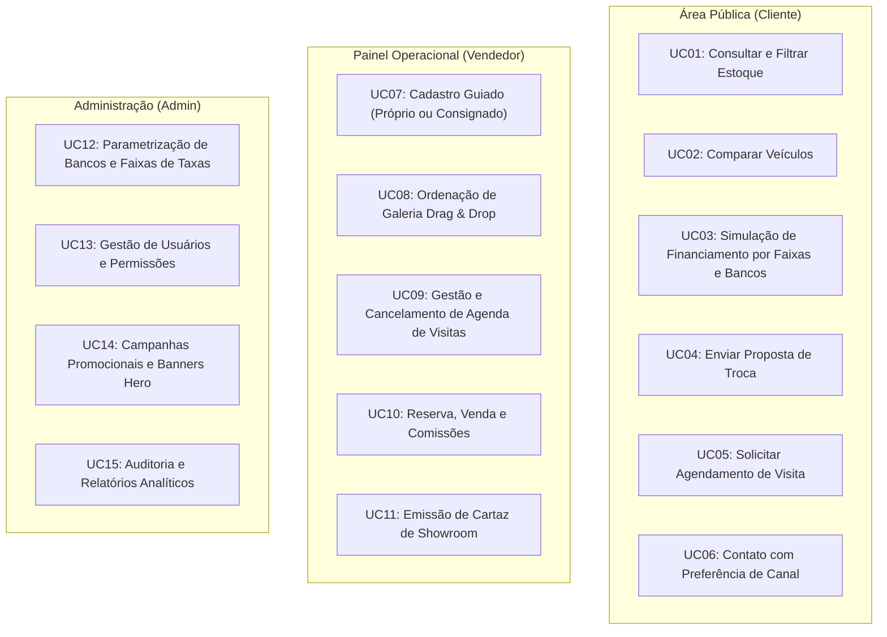
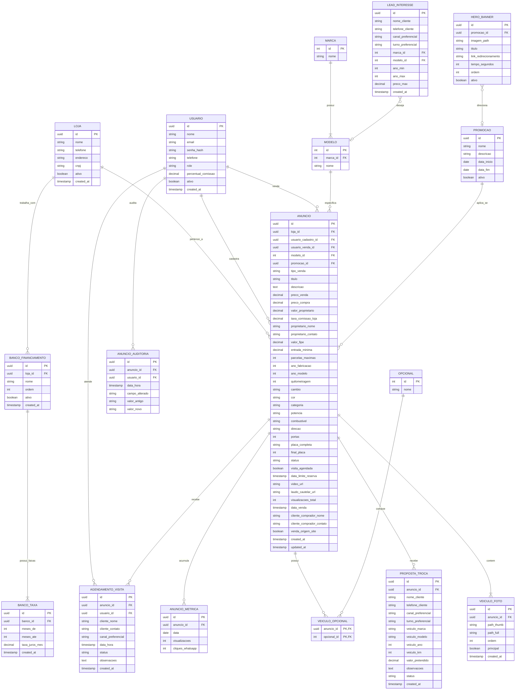

# Documento de Especificação e Arquitetura Geral (SiteGaragem)
## Sistema Integrado de Gestão de Estoque, CRM, Financiamento e Vitrine Digital Automotiva

---

### 1. Visão Geral do Projeto

O **SiteGaragem** é uma solução completa para lojas e concessionárias de compra e venda de veículos seminovos e novos, atendendo operações de estoque próprio e consignação. A plataforma integra dois ambientes sincronizados em tempo real:

1. **Backoffice Administrativo e Operacional (Lado Empresa)**: Gestão de pátio (próprio e consignado), ciclo de vida dos anúncios, esteira guiada de fotos com drag-and-drop, gestão de bancos e matriz de taxas por faixas de parcelamento, agenda de visitas físicas/test-drives, apuração de margens e comissões, emissão de cartazes de showroom em PDF e relatórios analíticos de conversão.
2. **Vitrine Digital Pública e Responsiva (Lado Cliente)**: Catálogo dinâmico de alta performance com busca multicritério, visualizador de fotos em alta definição com vídeo demonstrativo, simulador multi-bancos por faixas de prazo com aviso legal de CPF, comparador de modelos lado a lado, módulo de avaliação de veículos na troca e triagem de contato multicanal (WhatsApp, Ligação, E-mail).

---

### 2. Perfis de Usuários e Controle de Acesso (RBAC)

| Perfil | Identificador | Responsabilidades e Permissões |
| :--- | :--- | :--- |
| **Administrador** | `ADMIN` | Gestão de colaboradores, cadastro de bancos parceiros e faixas de juros (`BANCO_TAXA`), parametrização da loja, relatórios contábeis de lucratividade/comissões, expurgo físico de mídias e auditoria global. |
| **Vendedor** | `SELLER` | Cadastro guiado de veículos (próprios/consignados), ordenação da galeria de fotos, gestão da agenda de visitas/test-drives, negociações com reserva, fechamento de vendas e atendimento de propostas de troca e leads multicanal. |
| **Espectador** | `VIEWER` | Consulta interna somente leitura ao catálogo de estoque, status de visitas agendadas e relatórios consolidados de métricas. |
| **Cliente / Visitante** | `PUBLIC` | Consulta ao estoque ativo, aplicação de filtros, comparação de veículos, simulação de parcelamento por faixa e banco, envio de proposta de troca, agendamento de visita e seleção de canal preferencial de contato. |

---

### 3. Casos de Uso Principais (Use Cases)

#### UC01: Consultar e Filtrar Catálogo de Veículos
- **Ator**: Cliente (`PUBLIC`).
- **Pré-condição**: Veículo com status `ATIVO` ou `RESERVADO`.
- **Fluxo Principal**:
  1. O cliente visualiza a vitrine paginada (12, 24, 36 ou 48 itens).
  2. Aplica filtros combinados (categoria, marca, modelo dependente, combustível flex, faixa de preço, câmbio, opcionais).
  3. A listagem atualiza os cards sem recarga total da tela.
  4. O cliente abre os detalhes com fotos, laudo cautelar aprovado em PDF, vídeo integrado e especificações.
- **Regras**: Placa mascarada exibindo apenas o dígito final para fins de rodízio (LGPD).

#### UC03: Simulação de Financiamento com Faixas de Prazos e Bancos
- **Ator**: Cliente (`PUBLIC`).
- **Fluxo Principal**:
  1. Na página de detalhes do veículo, o cliente visualiza o simulador de parcelamento.
  2. Escolhe o banco parceiro desejado entre os ativos (ex: Santander, BV, Itaú, Bradesco, PAN).
  3. Ajusta o valor de entrada e seleciona a quantidade de parcelas (12x, 24x, 36x, 48x ou 60x).
  4. O sistema consulta na tabela `BANCO_TAXA` a taxa de juros exata vinculada à faixa do prazo selecionado (`meses_de <= prazo <= meses_ate`).
  5. O valor da parcela é calculado e apresentado com destaque para o **Aviso Legal Obrigatório**: *"Simulação com base na taxa média referencial da instituição para esta faixa de prazo. A aprovação, taxa real e valor final da parcela dependem de consulta ao CPF e score de crédito do cliente junto ao banco"*.
  6. Ao clicar em "Simular pelo WhatsApp", a mensagem é montada com o banco selecionado, entrada, parcelas calculadas e identificador do anúncio.

#### UC05: Solicitação e Gestão de Agendamento de Visitas / Test-Drive
- **Atores**: Cliente (`PUBLIC`) e Vendedor (`SELLER`).
- **Fluxo Principal**:
  1. O cliente clica em "Agendar Visita / Test-Drive" no anúncio e informa nome, contato e horário pretendido.
  2. O registro é salvo na entidade `AGENDAMENTO_VISITA` com status `AGENDADO`.
  3. No painel operacional do vendedor, o veículo exibe o marcador visual indicando "Visita Agendada" com data e hora.
  4. Caso o cliente desista ou ocorra imprevisto, o vendedor realiza o cancelamento da visita diretamente pelo sistema com 1 clique, liberando o pátio e disparando aviso.

#### UC06: Captação de Lead com Canal e Turno Preferencial
- **Atores**: Cliente (`PUBLIC`) e Vendedor (`SELLER`).
- **Fluxo Principal**:
  1. Ao preencher qualquer formulário de interesse ou avaliação de troca, o cliente seleciona o meio de contato de sua preferência (`WHATSAPP`, `LIGACAO_TELEFONICA`, `EMAIL`) e o turno (`MANHA`, `TARDE`, `NOITE`).
  2. O lead é catalogado no CRM interno com os atributos selecionados.
  3. O vendedor aciona o cliente exatamente pelo canal escolhido, reduzindo atritos de comunicação.

#### UC07: Cadastro Guiado de Veículo (Estoque Próprio vs. Consignado)
- **Ator**: Vendedor (`SELLER`) ou Administrador (`ADMIN`).
- **Fluxo Principal**:
  1. O operador escolhe o tipo de anúncio: `PROPRIO` ou `CONSIGNADO`.
  2. Se `PROPRIO`: informa `preco_compra` e `preco_venda` para apuração direta de lucro da loja.
  3. Se `CONSIGNADO`: preenche os dados do proprietário (`nome`, `telefone`), o `valor_proprietario` (valor líquido acordado com o dono) e a `taxa_comissao_loja` (percentual ou valor fixo de corretagem).
  4. Preenche características técnicas e descrição detalhada (incluindo eventuais manutenções e revisões realizadas no texto descritivo). Inserção inline imediata de novas marcas, modelos ou opcionais caso não existam.
  5. Realiza o upload das imagens e laudo cautelar em PDF.

#### UC08: Ordenação Manual da Galeria via Drag & Drop
- **Ator**: Vendedor (`SELLER`) ou Administrador (`ADMIN`).
- **Fluxo Principal**:
  1. Na tela de fotos do anúncio, o operador reordena as miniaturas arrastando e soltando (*drag-and-drop*).
  2. O primeiro item da lista ordenada (índice 0) é automaticamente assumido como foto de capa principal (`principal = true`).
  3. O painel despacha requisição `PATCH /anuncios/:id/fotos/reordenar` com o array de UUIDs ordenados, atualizando a ordem de exibição pública instantaneamente.

#### UC10: Fechamento de Venda, Lucratividade e Comissões
- **Ator**: Vendedor (`SELLER`) ou Administrador (`ADMIN`).
- **Fluxo Principal**:
  1. O vendedor confirma a venda e altera o status para `VENDIDO`.
  2. Informa dados do comprador e confirma se o lead foi originado pelo site.
  3. Para veículo `PROPRIO`: calcula lucro bruto = `preco_venda - preco_compra`.
  4. Para veículo `CONSIGNADO`: calcula margem da loja = `preco_venda - valor_proprietario` e apura a comissão do vendedor sobre a taxa retida.
  5. Dispara rotina de retenção histórica e agenda expurgo dos arquivos físicos em 7 dias.

#### UC11: Emissão de Cartaz de Showroom para Pátio Físico
- **Ator**: Vendedor (`SELLER`) ou Administrador (`ADMIN`).
- **Fluxo Principal**:
  1. No painel de estoque, o operador aciona "Imprimir Cartaz de Showroom".
  2. A API gera PDF em folha A4 com logo, especificações técnicas, preço de vitrine e QR Code dinâmico para a página do anúncio.
  3. O documento é impresso e afixado no para-brisa do veículo na loja física.

#### UC12: Parametrização de Bancos e Matriz de Taxas por Faixas
- **Ator**: Administrador (`ADMIN`).
- **Fluxo Principal**:
  1. O administrador cadastra as instituições parceiras (`BANCO_FINANCIAMENTO`).
  2. Para cada banco, cadastra as faixas de parcelamento em `BANCO_TAXA` (ex: 1 a 12 meses -> 1.19% a.m., 13 a 24 meses -> 1.35% a.m., 25 a 36 meses -> 1.49% a.m., etc.).
  3. A matriz abastece com precisão as simulações na vitrine pública.

---

### 4. Módulos Funcionais do Sistema

#### 4.1. Lado Empresa (Backoffice & ERP)
- **Gestão de Acessos (RBAC)**: Autenticação JWT, colaboradores e papéis de permissão.
- **Estoque Híbrido**: Gestão unificada de veículos próprios e consignados com cálculo automático de margens de intermediação.
- **Galeria Interativa (Drag & Drop)**: Reordenação manual de fotos com definição automática de foto de capa no índice 0.
- **Matriz de Financiamento por Faixas**: Cadastro de bancos e tabela auxiliar de taxas conforme prazo de financiamento.
- **Agenda de Pátio**: Visualização de veículos com visita agendada e botão de cancelamento direto em 1 clique.
- **CRM e Leads Multicanal**: Atendimento a propostas de troca e contatos com indicação do meio (WhatsApp/Ligação/E-mail) e turno escolhido.
- **Cartaz de Showroom**: Emissão de PDF em folha A4 com QR Code dinâmico.
- **Auditoria e Métricas**: Trilha de alterações em anúncios e contagem com rate limiting anti-fraude.

#### 4.2. Lado Cliente (Vitrine Pública)
- **Home Page**: Header inteligente, carrossel Hero com tempo individual por banner (`tempo_segundos`), atalhos visuais por categoria e lista resumida de novidades.
- **Catálogo Geral**: Menu lateral de filtros acumulativos (combustível com regra flex, marcas, modelos vinculados, opcionais via tabela associativa, final de placa).
- **Detalhes do Veículo**: Galeria com zoom, vídeo do YouTube integrado, selo e visualizador de Laudo Cautelar em PDF e comparativo FIPE.
- **Simulador por Faixas de Bancos**: Seleção da instituição, busca automática da taxa pela faixa de parcelas e aviso legal obrigatório sobre CPF/score.
- **Formulário de Troca e Agendamento**: Envio de dados do veículo usado e solicitação de visita no pátio físico.
- **Comparador Flutuante**: Comparação lado a lado de até 3 carros selecionados persistidos no `localStorage`.

---

### 5. Regras de Negócio Consolidadas (RN)

1. **[RN001] Compatibilidade de Combustível Flex**:
   Filtros por "Gasolina" ou "Álcool" incluem obrigatoriamente veículos cadastrados como "Flex".
2. **[RN002] Visibilidade Pública Estrita**:
   Apenas anúncios `ATIVO` e `RESERVADO` aparecem na vitrine. Anúncios em reserva exibem tarja visual de bloqueio.
3. **[RN003] Mascaramento de Identificadores (LGPD)**:
   A placa completa e dados do proprietário são restritos a `ADMIN` e `SELLER`. Na vitrine pública, apenas o `final_placa` é exposto.
4. **[RN004] Expiração Automática de Reservas e Negociações**:
   Status `RESERVADO` ou `EM_NEGOCIACAO` possui `data_limite_reserva` (padrão de até 7 dias). Após expiração sem venda, o status retorna automaticamente para `ATIVO`.
5. **[RN005] Política de Purga de Mídias e Retenção Histórica**:
   Registros e métricas de vendas são mantidos permanentemente no banco. Imagens e laudos de veículos vendidos são expurgados fisicamente do disco após 7 dias, ou imediatamente em caso de exclusão manual (`EXCLUIDO`).
6. **[RN006] Otimização Mandatória de Imagens (Sharp)**:
   Uploads de fotos são convertidos para WebP (qualidade 80%) e subdivididos em `thumb` (400x300px) e `full` (1280x960px). Originais brutos são descartados.
7. **[RN007] Anti-fraude em Métricas de Visualização**:
   Acessos do mesmo par (IP + User-Agent) em janela inferior a 30 minutos contam como apenas 1 visualização no banco.
8. **[RN008] Regra de Foto de Capa (Drag & Drop)**:
   A foto posicionada no índice 0 da galeria é automaticamente persistida com `principal = true`, e as demais como `false`.
9. **[RN009] Cálculo de Margem por Tipo de Venda**:
   - `PROPRIO`: `lucro_bruto = preco_venda - preco_compra`.
   - `CONSIGNADO`: `margem_loja = preco_venda - valor_proprietario`. A comissão do vendedor incide sobre a margem retida pela loja.
10. **[RN010] Cadastro Dinâmico Inline**:
    Inserção imediata de Marca, Modelo ou Opcional sem sair da tela de cadastro de anúncio.
11. **[RN011] Transparência e Disclaimer Legal de Financiamento**:
    Toda simulação consulta a taxa da faixa correspondente em `BANCO_TAXA` e exibe aviso legal obrigatório informando que o resultado é uma estimativa referencial sujeita a consulta de CPF/score de crédito.
12. **[RN012] Descentralização de Visitas de Pátio**:
    O veículo com agendamento ativo impede marcação concorrente no mesmo horário, e o cancelamento pode ser executado diretamente pelo vendedor no painel.

---

### 6. Modelo de Entidades e Relacionamentos (MER)

---

### 7. Arquitetura Técnica

- **Back-end (API REST)**: Node.js com TypeScript em arquitetura limpa (Controllers, Services, Repositories).
- **Banco de Dados**: PostgreSQL com identificadores UUIDv4 e índices em `status`, `modelo_id`, `categoria`, `preco_venda`, `ano_modelo`, `tipo_venda` e `created_at`.
- **Tabela Associativa N:N**: `VEICULO_OPCIONAL` indexada por chave composta (`anuncio_id`, `opcional_id`) para consultas de alta performance.
- **Processamento de Mídias**: Sharp para conversão WebP, geração de `thumb` (400x300) e `full` (1280x960), com suporte a reordenação de índices e descarte de brutos.
- **Documentos e PDFs**: Geração de Cartazes de Showroom em folha A4 com QR Code dinâmico via `pdfkit` / `puppeteer`.
- **Front-end**: Framework SPA/SSR (Next.js) para renderização prévia de metatags OpenGraph e simulador financeiro interativo por faixas de prazo.

---

### 8. Roadmap de Implementações Futuras

1. **Integração com Marketplaces**: Exportação de estoque para OLX, Mercado Livre, Webmotors e Facebook Marketplace.
2. **Integração Bancária Automática**: Consulta de crédito e esteira de aprovação com instituições financeiras diretamente pela API.
3. **Distribuição Automatizada de Leads (Round-Robin)**: Rotação equilibrada de leads entre os vendedores de plantão.
4. **Módulo Fiscal**: Emissão de notas fiscais eletrônicas de entrada, saída e serviço.
5. **Multi-Filiais**: Gestão multi-lojas e transferência de veículos entre diferentes pátios físicos.
